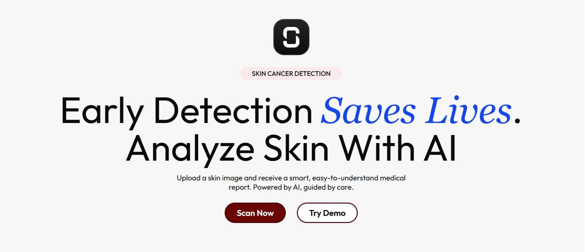

# ScanMyMole

AI-powered **skin lesion analysis** for early detection support. Upload a photo of a mole or skin spot and receive a risk-oriented report with class probabilities.

**Live demo:** [scanmymole.vercel.app](https://scanmymole.vercel.app)

> ⚠️ **Disclaimer**  
> ScanMyMole is not a medical device and does not provide diagnoses. It is intended for educational purposes only. Always consult a licensed clinician for medical advice or treatment.

---

## Features

- 🧠 AI-assisted mole & lesion screening with pretrained models  
- 🌐 Frontend hosted on **Vercel**  
- ⚡ Backend served via **FastAPI** on **Hugging Face Spaces**  
- 🔒 **Redis**-based rate limiting for fair use  
- 📦 **Dockerized** backend for portability  
- 🔁 Automated builds & deploys with **GitHub Actions**  
- 🧩 Monorepo setup with **pnpm + Turborepo** for frontend + shared packages 

---

## Tech Stack

- **Frontend:** Next.js + TypeScript (Turborepo app, deployed on Vercel)  
- **Backend:** FastAPI (Dockerized, deployed on Hugging Face Spaces)  
- **Infra:** Redis (rate limiting), GitHub Actions (CI/CD), Vercel (web hosting)  
- **ML:** Model + configs hosted on [Hugging Face]